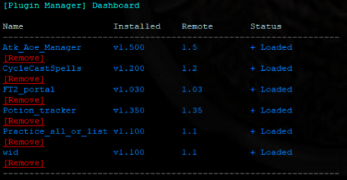
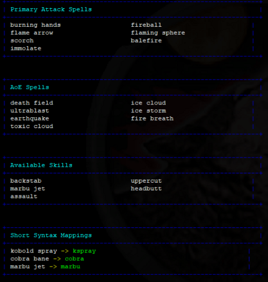
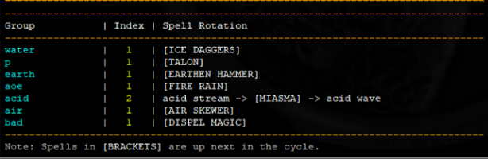
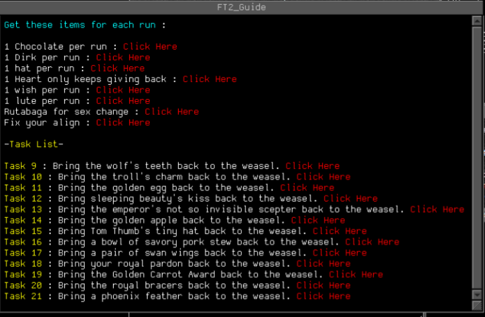
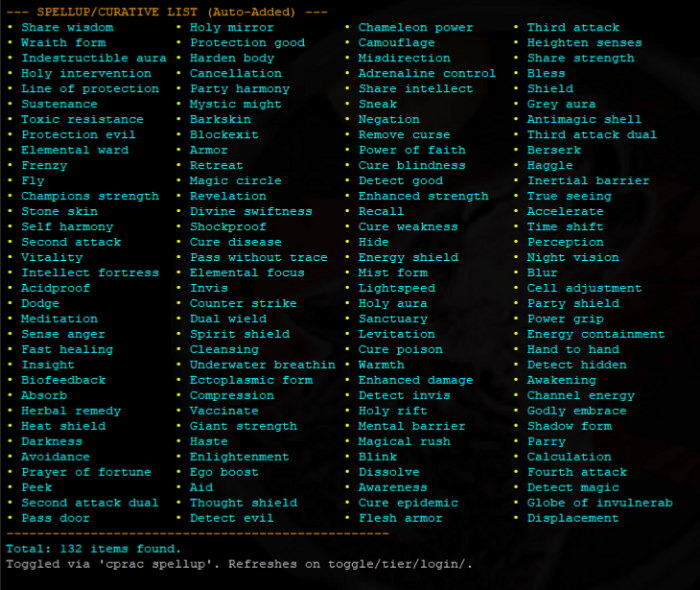
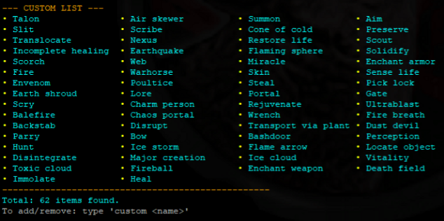
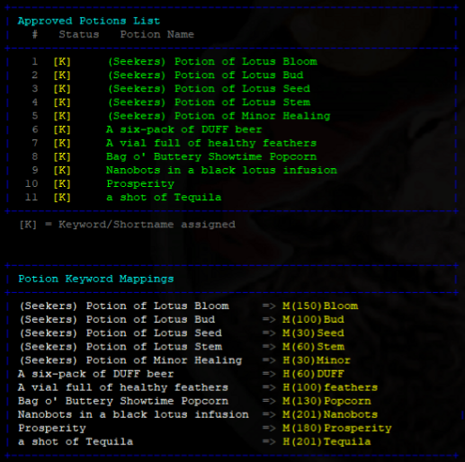
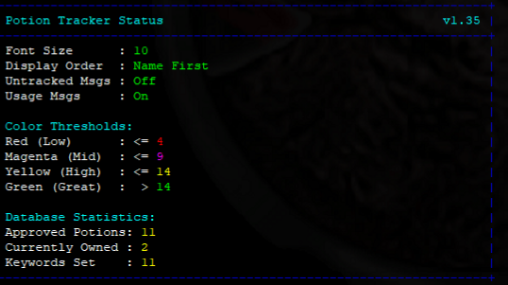
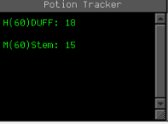

# ⚔️ Khrysis MUSHclient Plugins ⚔️
### *Aardwolf MUD Utility & Logic Collection*

> **Streamlined character progression, advanced variable management, and task navigation.**

---

### 📥 Quick Start
**Requirement:** [MUSHclient](-http://www.gammon.com.au/mushclient/mushclient.htm-) + [Aardwolf MUD](https://www.aardwolf.com/)

**To Install:** 1. Download the desired `.xml` file from the list above.
2. In MUSHclient, press **Ctrl + Shift + P** (Plugin Manager).
3. Click **Add** and select the file you downloaded.

---

  
<b>Khrysis_Plugin_Manager</b> (Click to see Dashboard)

  
  > **Description:** The central hub for all Khrysis plugins. This dashboard allows you to manage everything in one place and keep a check on the status of your plugins.

  **Key Features:**
  * **Unified Management:** See all your installed Khrysis plugins at a glance using the `kpm list` command.
  * **Dashboard View:** A clean interface to monitor your plugins and their current status.
  * **Organized Control:** Manage settings and stay on top of your plugin library from one central location.

  **KPM Dashboard / List Output:**
  

  
<b>Aoe_Atk_Manager</b> (Click to see Status and List)

  
  > **Description:** Automatically updates AOE, ATK, or Skill variables based on a custom list that persists through remorts or tiers. 

  **Key Features:**
  * **Auto-Updating:** Variables stay current even after you Tier or Remort.
  * **Syntax Mapping:** Handles skills that require specific input (e.g., mapping *Kobold Spray* to the required `kspray` command).
  * **Unified Commands:** Use `aam skill` or `aam skill <target>` regardless of which skill is currently active in your list.

  | AAM List All | AAM Status |
  | :--- | :--- |
  |  |  |

  
<b>CycleCastSpells</b> (Click to see demo)

  
  > **Description:** Allows you to create lists of spells to cast from using simple commands. Make as many different types of lists and define your own command to cast through it.

  **CC List Output:**
  

  
<b>FT2_portal</b> (Click to see Guide Window)

  
  > **Description:** Streamlines the FT2 portal goal from Task 9 all the way to the end. This is an all-in-one solution that includes a built-in riddle solver, so no additional riddle plugins are required.

  **Key Features:**
  * **Goal Navigation:** Specifically designed to guide you through the final stages of the FT2 portal goal.
  * **Built-in Riddles:** Automatically handles the riddle portions of the quest.
  * **Dedicated Guide Window:** Displays your current progress and next steps in a clean miniwindow.

  **FT2 Guide Window:**
  

                                                       

  
<b>Practice_all_or_list</b> (Click to see List examples)

  
  > **Description:** Practice everything at once or keep a focused list of only the specific spells/skills you want to train. 

  **Key Features:**
  * **Automatic Generation:** Syncs with your spellup list for easy management.
  * **Custom Control:** Create your own custom lists to target specific skills.
  * **Efficiency:** Save time and practices by only training exactly what you need.

  | Spellup List (cprac slist) | Custom List (cprac clist) |
  | :--- | :--- |
  |  |  |

  
<b>Potion_tracker</b> (Click to see Status, Lists, and Window)

  
Manages potions in a miniwindow. Examples of some commands ptw list or ptw kw list and status.

  | Feature | Image Preview |
  | :--- | :--- |
  | **PTW List** |  |
  | **PTW Status** |  |
  | **PTW Window** |  |

wid — Automatically captures and stores unique IDs for your Primary, Secondary, and Held gear; includes smart equip/remove logic and mode-aware re-equipping.

Plugins with update scripts so far - Aoe_Atk_Manager, CycleCastSpells, Practice_all_or_list, FT2_portal, Potion_tracker

